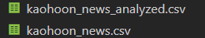
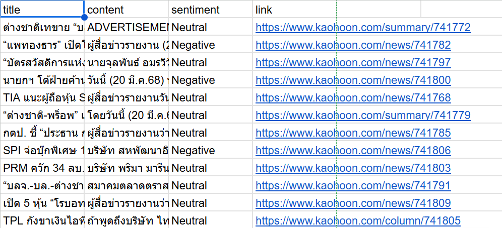

# Stock News Analysis with Sentiment Classification  

## Overview  
This project automates the collection, processing, and sentiment analysis of stock-related news articles from Kaohoon. It involves web scraping, data preprocessing, sentiment classification using WangchanBERTa, and a scheduled data pipeline.  

## Features  
- **Web Scraping**: Extracts stock news articles from Kaohoon.  
- **Data Preprocessing**: Cleans and prepares data for analysis.  
- **Sentiment Classification**: Categorizes articles as Positive, Negative, or Neutral using WangchanBERTa.  
- **Automated Workflow**: Uses Python `schedule` to continuously fetch and analyze data.  

## Installation  
Ensure Python is installed, then install dependencies:  
```sh  
pip install -r requirements.txt  
```  

## Workflow  
### 1. Set the Data Collection Schedule  
Modify `runtask.py` to define the frequency of data collection. Example (runs every 2 minutes):  
```python  
schedule.every(2).minutes.do(run_tasks)  
```  

### 2. Web Scraping (`scrapedata.py`)  
`runtask.py` calls `scrapedata.py` to fetch articles from Kaohoon.  

#### Key functions in `runtask.py`:  
- **`setup_chrome()`** – Configures the Chrome environment for web scraping.  
- **`load_existing_titles()`** – Checks for previously stored data to avoid duplication.  
- **`get_news_links(driver)`** – Extracts article links from the website.  
- **`get_news_content()`** – Collects, verifies, and saves articles to `kaohoon_news.csv`.  

### 3. Sentiment Analysis (`sentiment_Wangchan.py`)  
`runtask.py` calls `sentiment_Wangchan.py` to analyze the collected news.  

#### Key functions in `sentiment_Wangchan.py`:  
- Loads a **pretrained model and tokenizer** from Hugging Face: `airesearch/wangchanberta-base-att-spm-uncased`.  
- Creates a **pipeline** for sentiment classification.  
- Processes news articles in **batches** to improve efficiency.  
- Loads data from `kaohoon_news.csv` and ensures no duplicate analysis.  
- Saves results to `kaohoon_news_analyzed.csv`.  

## Output Files  
- **`kaohoon_news.csv`** – Raw scraped news articles.  
- **`kaohoon_news_analyzed.csv`** – Articles with sentiment labels (Positive, Neutral, Negative).  

## Automation  
The script runs at scheduled intervals, continuously updating sentiment analysis results.  

---  

### How to Run  
1. Install dependencies:  
   ```sh  
   pip install -r requirements.txt  
   ```  
2. Set the schedule in `runtask.py`.  
3. Run the script:  
   ```sh  
   python runtask.py  
   ```  
4. The script will automatically fetch news and analyze sentiment at the defined intervals.  

---  
### Example Outputs  
  
  

